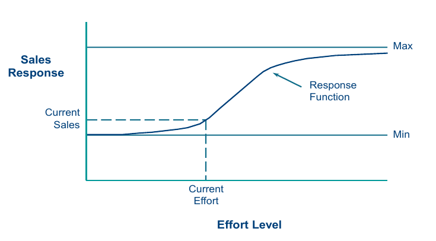
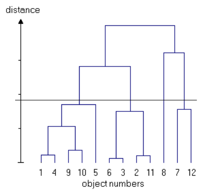
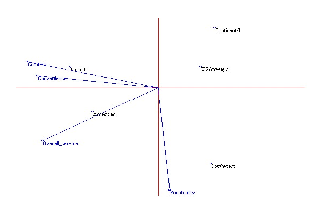
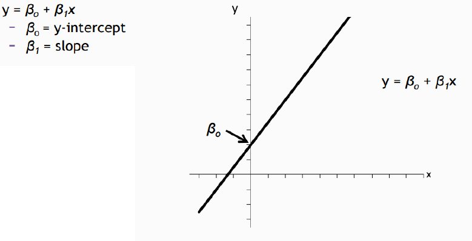
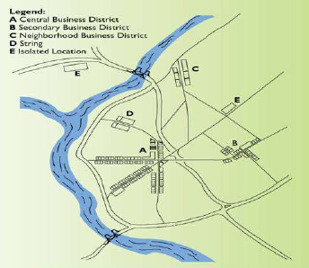

# {-}

Deze samenvatting werd gemaakt voor het OPO Marketing Engineering (B-KUL-D0H54a-1617).
Er werd vooral gebruik gemaakt van de slides, en de structuur van de slides word dus voor het grootste deel gevolgd.

# Intro
Hoe beslissingen maken

Ervaring, gevoel $\leftrightarrow$ Data overload

Juiste balans vinden
-> __Beslissingsmodellen__

Een model is een vereenvoudigde weergave/voorstelling van
de realiteit die het makkelijker maakt om een specifiek
probleem te bestuderen dan de realiteit zelf
Modellen zijn de kern van marketing engineering

~~Data~~ -> __Information -> Information -> Insights -> Decisions__ -> ~~Implementation~~

# Informatieverzameling
__Data -> Information__ -> Information -> Insights -> Decisions -> Implementation

## Secundaire bronnen
Resultaat van eerder onderzoek met een ander doel

- Gegevens zoals: verkopen per regio, per klant, per product, klachten, rapporten
- Publieke bronnen: kamer van koophandel, vakbonden, andere organisaties
- Niet Publiek bronnen: bv. __Syndicated services.__ Marktonderzoeksorganisaties die informatie aanieden vanuit een gemeenschappelijke database aan verschillende bedrijven die zich hebben ingeschreven voor deze diensten. (bv. Nielsen)

Kwaliteit nakijken

- Wat was het doel van d studie?
- Wie verzamelde de info?
- Welke info?
- Hoe?

Hoe verzamelen syndicated services hun data?

- Data kopen van winkels
- Klanten bevragen
    - bv. Consumentenpanel
- Andere technieken

__Consumentenpanel__ longitudinale, continue studie van een representatieve steekproef van consumenten. Waarvan men bepaalde informatie herhaaldelijk meet.

- Alles dat wordt gekocht
    - Waar
    - Hoeveel
    - Voor welke prijs
- Invloed van reclame
    - __Weight test__ freq. van reclame varieert
    - __Copy test__ freq. blijft gelijk, inhoud varieert


## Primaire bronnen
Resultaat van onderzoek

Wordt meestal verzameld door onderzoeksbureaus

- Exploreren
    - Vrijblijvend inzichten leveren en ontwikkelen
    - Minder gestructureerd
    - Kwalitatief
- Confirmeren
    - Concrete vraag beantwoorden, een beslissing helpen nemen
    - Meer gestructureerd
    - Kwantitatief

### Kwalitatief onderzoek
- Diepte interviews (intensief individueel)
- Focusgroep

Als het waarom en hoe centraal staat: 

> ‘Relevante’ (i.p.v. representatieve) personen
> met expertise, met bijzondere en met divergerende
> (uiteenlopende, eigen) ervaringen, die goed in staat zijn
> hun ervaring en beleving te communiceren, die ons
> inzichten kunnen geven

Inhoud van gesprekken wordt verwerkt. Wat kwam aan bod en hoe vaak, misschien in combinatie met andere thema's. Het resultaat is een basisinzicht en een toetsbare hypothese.

### Kwantitatief onderzoek
- Sterke structurering
    - Precieze antwoorden (coderen en kwantificeren)
- Voldoende omvang
- Representatief

__Survey.__ Een onderzoek of enquête aan de hand van een vragenlijst.

- Precieze vragen
    - Zie sectie questionaire development
- Kwantitatieve codering
- Forceert de respondent in een denkkader
- Omvang en representativiteit van de steek proef belangrijk

__Observatie.__ Bekijken en coderen van gedrag om systematische patronen te ontdekken.

- Garbology (onderzoek van afval)
- Scanner data
- Eye tracking
- Clickstream-data (data van internetgebruik)

__Experiment.__ Zoals een observatie maar onder gecontroleerde omstandigheden.

- Manipuleren van een of meerdere cruciale voorspellende variabelen
    - soort verpakking
    - soort reclame
- Meting van een of meerdere gedragsvariabelen
    - Attitude tov advertentie, merk
    - risicogedrag
    - eetgedrag
- Controle of randomisatie van andere variabelen


### Model of simulaties
Komt later aan bod

### Questionaire development
Soorten vragen

- Administratieve, identificatie vragen
- Target, basis vragen
- Classificatie vragen
    - Filter, screening vragen

Inhoud van een vragenlijst

- Is de vraag nodig?
- Heeft de vraag de juiste scope en dekt het de lading?
    - Onvolledig of unfocused
    - Onduidelijk
    - Double-barreld (vraag die meer dan een onderwerp aanhaalt)
- Kan en is de respondent bereid op de vraag te antwoorden?
    - Tijd
    - Voorkennis
    - Objectiviteit (geen _leading_ vraag, die aanzet tot een antwoord)
    - Herinnering (Weet de respondent nog genoeg)
    - Balans (algemeen en specifiek)
- Verwoording
    - Vermijd technisch taalgebruik
    - Geen ambigue woorden
    - Vermijd impliciete assumpties
    - Geen vertekend woordgebruik
    - Wees consistent qua personalisatie
    - Bevat de vraag correcte alternatieven

# Market Response Modellen
Is de bouwsteen van een beslissingsmodel. Zorgt ervoor dat het maken van beslissingen systematisch kan. Vereist het expliciet maken van

- Inputs
- Response Model
- Objectieven

{height=5cm}

Kan zeer complex of eenvoudig zijn

- Aantal variabelen
- Rekening houden met competitie
- Type van relaties
- Statisch of dynamisch
- Individueel of geaggregeerde respons
- Niveau van vraag

## Geaggregeerde Response Modellen

Nr.    Verklaring
---    --------------------------------------------------------------------------------------------
P1     Output is nul wanneer input nul is
P2     Output-input verband is lineair
P3     Meeropbrengsten dalen als input stijgt (concaaf)
P4     Output kan een bepaald niveau niet overschrijden (saturatie)
P5     Meeropbrengsten stijgen als input stijgt (convex)
P6     Meeropbrengsten stijgen eerst en vervolgens dalen als input stijgt (S-shape)
P7     Input moet bepaald niveau overschrijden vooraleer het enige output kan produceren (treshold)
P8     Output daalt als bepaalde input-niveau overschreden is (supersatuaratie)
---    --------------------------------------------------------------------------------------------

Table: Verklaring bij figuur \ref{fig:f}


## Lineair Model

$Y = a+bx$

Te eenvoudig, meer $\neq$ beter

## Fracional Root Model

$Y = a+bx^c$

Lineair, stijgende of dalende opbrengsten (afhankelijk van c)

## Exponential Model

$Y=ae^{bx}; x>0$ 

Stijgende of dalende meeropbrengsten (afhankelijk van b)

$Y=a(1-e^{-bx}) + c$ 

$a+c$ is de bovengrens (saturatie)
$c$ is de ondergrens

## ADBUDG Model

$Y=b+(a-b)\frac{X^c}{d+X^c}$

- $0<C<1$ de functie is concaaf
- $C>1$ de functie is S-shaped
- $b$ is de ondergrens
- $a$ bovengrens (saturatie)

Wordt vaak gebruikt om response op reclame effort te modeleren. 
Een goed model voor subjectieve calibratie.

## Calibratie
__Calibratie__ is het toewijzen van goede waarden voor de parameters in het model.

__Subjectieve (judgmental) calibratie__ wordt toegepast op basis enkele vragen.
 
#. Wat is huidig niveau van reclame en verkoop
#. Wat is de verkoop als de hoeveelheid advertenties = 0?
#. Wat is de verkoop als de hoeveelheid advertenties daalt met 50%?
#. Wat is de verkoop als de hoeveelheid advertenties stijgt met 50%?
#. Wat is de verkoop als de hoeveelheid advertenties = $\infty$?

## Uitbreiding

### Meer variabelen
De nieuwe variabelen kunnen opgeteld (additief model) of vermenigvuldigd worden (multiplicatief model).

### Dynamische effecten

\begin{figure}
    \centering
    \begin{subfigure}[b]{0.3\textwidth}
        \includegraphics[width=\textwidth]{./graphics/DEmarketingEffort.png}
        \caption{Marketing effort}
    \end{subfigure}
    ~
    \begin{subfigure}[b]{0.3\textwidth}
        \includegraphics[width=\textwidth]{./graphics/DEdelayed.png}
        \caption{Delayed response \& Customer holdout effect}
    \end{subfigure}
    ~
    \begin{subfigure}[b]{0.3\textwidth}
        \includegraphics[width=\textwidth]{./graphics/DEhysteresis.png}
        \caption{Hysteresis effect}
    \end{subfigure}
    \begin{subfigure}[b]{0.3\textwidth}
        \includegraphics[width=\textwidth]{./graphics/DEnewTier.png}
        \caption{New tier, wear out effect}
    \end{subfigure}
    ~
    \begin{subfigure}[b]{0.3\textwidth}
        \includegraphics[width=\textwidth]{./graphics/DEstocking.png}
        \caption{Stocking effect}
    \end{subfigure}
    \caption{Investering in marketing en gevolgen in verkoop}
    \label{fig:de}
\end{figure}

### Marktaandeel (Competitie)

$$ M_i = \frac{A_i}{A_1 + A_2 + ... + A_n}$$

- $M_i$ is het marktaandeel van een merk $i$.
- $A_i$ is de attractiveness van een merk $i$.
- Er zijn $n$ spelers op de markt.


## Gedisaggregeerde Response Modellen
### Multinomial logit model
De kans dat een individu $i$ voor merk $1$ kiest.

$$ P_i1 = \frac{e^{A_1}}{\sum_j e^{A_j}} $$
waarbij

- $A_j = \sum_k w_k b_{ijk}$ is de attractiveness van een product $j$ voor individu $i$.
- $B_{ijk}$ is de mening van individu $i$ over het merk $j$ op basis van een kenmerk (bv. kwaliteit) $k$.
- $w_k$ bepaalt hoe belangrijk een kenmer $k$ is.

## Shared-experience Modellen
Response modellen gebaseerd op gedrag geobserveerd bij andere bedrijven.

### PIMS Model
Profit Impact of Marketing strategy

Ervaringen van een diverse groep succesvolle en minder succesvolle bedrijven geven een nuttig inzicht in de factoren die een rol spelen in de winstgevendheid van een bedrijf. 

Enkele factoren die geassocieerd worden met winstgevendheid

- Groeiende markt
- Vroege life cycle
- Hoge inflatie
- Weinig aanbod
- Hoog marktaandeel
- Lage (relatieve) kost
- Hoge (gepercipieerde) kwaliteit
- ...

## Kwalitatieve Response Modellen

Meestal gebaseerd op regeltjes (if x then y else z)

### ADCAD Systeem
ADCAD (ADvertising Communication Approach Design) is een systeem gebaseerd op regels dat helpt bij het maken van een advertentie. Er zijn enkele doelen.

- Primaire vraag aanmoedigen
- Herhaalde aankopen en brand loyalty aanmoedigen
- ...


Voor een advertentie campagne worden enkele dingen rekening overwogen.
\begin{minipage}[b]{0.45\linewidth}\centering
\begin{itemize}
\item Formaat
\begin{itemize}
    \item Demonstratie v/product
    \item Endorsment door een beken persoon
    \item ...
\end{itemize}
\item Presentator
\begin{itemize}
    \item Leeftijd
    \item Geslacht
    \item Herkenbaarheid
    \item ...
\end{itemize}
\item Presentatie technieken
\begin{itemize}
    \item Slogan, deuntje
    \item Scenario
    \item Humor
    \item Hidden-camera
    \item ...
\end{itemize}
\end{itemize}
\end{minipage}
\begin{minipage}[b]{0.45\linewidth}\centering
\begin{itemize}
\item Emotie
\begin{itemize}
    \item Woede
    \item Angst
    \item Optimisme
    \item Vertrouwen
    \item ...
\end{itemize}
\item Voordelen
\begin{itemize}
    \item Prijs
    \item Waarde
    \item Veiligheid
    \item Plezier
    \item ...
\end{itemize}
\end{itemize}

\end{minipage}
    
__Voorbeeld van Regels__
```
IF product life cycle stage = introduction
    AND innovation type = discontinuous
    THEN marketing objective = simulate primary demand

IF ad objective = convey brand information or reinforce brand beliefs
    AND market share > 18.5
    AND brand switching = high
    AND product type = existing
    THEN technique = sign off
```

Als invoer voor ADCAD gebruikt men informatie over het doelpubliek (geslacht, frequentie gebruik van product, loyalty, vorige merk, interval tussen aankopen) de productklasse (life cycle, competitie, mogenlijkheid om te demoen) en de karakteristieken van het merk en de competitie (marktaandeel, qualiteit, verpakking, prijs van concurrent).

Als uitvoer krijgt men verkoop doelen en communicatie aanpakken.

# Segmentatie & Targeting
STP (Segmentatie, Targeting & Positioning)

- __Segmentatie.__ Identificeer groepen van klanten (segmenten).
    1. Marktsegmentatie
    2. Segmenten beschrijven
- __Targeting.__ Kies een segment waaraan je wil verkopen.
    3. Evalueren attractieve (goede) segmenten
    4. Selecteren van doel segmenten & het alloceren van middelen
    5. Vinden van de consumenten in de doelgroep
- __Positioning.__ Plaats product in de gedachten van de klanten
    6. Identificeer mogelijk positionerincomcepten voor elke doelgroep
- __Approaching.__ Selecteer marketing mix die het best bij het segment past.
    7. Selecteer, ontwikkel en communiceer het concept 

## Segmentatie
__Segmentatie.__ Het opdelen van mensen in groepen zodat mensen in een groep gelijk zijn een mensen in andere groepen anders. (in ways that matter to the business and market)

> _"It only makes sense if the identified segments also respond differently to different marketing stimuli."_

### Marktsegmentatie

#. Waarom segmenteren we de markt?
#. Selecteer segmentatie variabelen.
    - __Geografische__ segmentatie
    - __Demografische__ segmentatie (Geslacht, inkomen, beroep, leeftijd)
    - __Psychogafisch__ segmentatie (Levensstijl, persoonlijkheid, waarden)
    - __Gedragsmatige__ segmentatie (Gelegenheid, voordelen, gebruiksstatus, mate van gebruik, loyaliteit, houding)
#. Selecteer een mathematische & statistische procedure om consumenten samen te nemen in segmenten.
#. Groepeer consumenten in een vastgelegd aantal segmenten.

### Beschrijving Marktsegmenten
Needs, wants, benefitsm solutions to problem, usage situation, usage rate

__Bases__ zijn __afhankelijke variabelen__, kenmerken die aangeven waarom segmenten verschillen.

__Descriptors__ zijn __onafhankelijke variabelen__ kenmerken die helpen segmenten te vinden en te bereiken.

## Targeting
Beperkte middelen -> Niet tot iedereen richten

> -> Keuze maken en op beperkte doelgroep richten.

Twee strategieën

- __Diversificatie__, op verschillende segmenten richten.
    - Moeilijkheden in een segment opvangen door succes in een ander.
- __Focus__, op 1 segment focussen.
    - Voornamelijk in zeer competitieve markten.

### Attractiviteit Segment
Table: Factoren die de aantrekkelijkheid van een segment bepalen

Factor                            Uitleg, voorbeelden
------------------------------    ------------------------------------------------------------------
Groote                            Market potential, current market penetration
Groei                             Past growth forecasts of technology change
Competitie                        Barriers to entry, barriers to exit, position of competitors, ability to retaliate
Saturatie                         Gaps in the market
Beschermbaarheid                  Patentability of products, barriers to entry
Risco's                           Economic, political, and technological change
Winstgevendheid                   Coherence with company’s strengths and image
Relatie met andere segmenten      Synergy, cost interactions, image transfers, cannibalization
Geschiktheid                      Entry costs, margin levels, return on investment
------------------------------    ------------------------------------------------------------------

### Selecter doelsegmenten
### Vinden van consumenten in de  doelgroep

- Zelfselectie
    - Meest voorkomend
    - bv. winkels
- Scoring mehtodes
    - Bv. bank, verzekering

## Segmentatie onderzoek

1. Ontwikkelen meetinstrumenten
2. Selecteren steekproef
3. Selecteren & aggregeren respondenten
4. Analyseren van data & segmenteren van de markt

Selectie Respondent & Aggregatie, de beslissing om het product te kopen voor een eenheid wordt niet door een persoon (respondent gemaakt)

- Wie maakt aankoopbeslissing?
- Rol van individuen (aankoper, gebruiker, gatekeeper, finaancieel analist).
- Hoeveel respondenten per eenheid.
    - Noden verschillen

Segmentatie kan met behulp van verschillende methodes

- Factor analyse (data reductie)
- Cluster analyse (Segmenten vormen)
- Discriminant analyse (Segmenten bescrhijven)

## Cluster analyse
- Maatstaf definiëren om de mate van gelijkenis tussen klanten te meten op basis van hun noden.
- Groepeer klanten met gelijkaardige noden.
    - Hierarchische clustering (Ward’s methode)
    - Niet hierarchische clustering (K-Means)
- Aantal segmenten kiezen op basis van strategische criteria, eigen oordeel en cijfers.
- Een profiel maken van de noden van de geselecteerde segmenten.

De "afstand" tussen klanten $i$ en $j$ op basis van een antal numerieke variableen $a, b, c, ..., y, z" wordt berekend zoals de afstand in de ruimte (euclidische afstand).
$$D_{ij} = \sqrt{(a_i-a_j)+(b_i-b_j)+...+(z_i-z_j)}$$

__Ward's methode__ is een __hiërarchische methode__ om clusters te vinden aan de hand van deze afstand. Hiërarchisch wil zeggen dat clusters zelf in clusters zitten er moet dus een _level_ van cluster gekozen worden om met verder te gaan. Het _level_ bepaalt dus ook het aantal clusters dat we uitkomen. Het is belangrijk dat we bij het kiezen van clusters zo weinig mogelijk informatie verliezen.
Het verlies van informatie wordt gemeten door de afstand tussen de afwijken van elke observatie met het clustergemiddelde.

Als resultaat krijgen we een __dendrogram__, dit is een grafiek met individuen op de x-as, deze worden recursief per twee verbonden om een cluster te bepalen. Het  verlies van informatie wordt op de y-as geplaatst.

Om een optimaal aantal clusters te kiezen kan je een rechte door de dendrogram trekken waar de afstand tussen de het vormen van de clusters klein is (dus weinig verlies). Zie figuur \ref{fig:dend}.

{height=5cm}

### Discriminant analyse

Een __disciminant analyse__ is het afleiden van een lineaire combinatie onafhankelijke variabelen op een manier dat de resulterende combinatie in staat is zo goed mogelijk te discrimineren tussen twee of meer a priori gedefinieerde groepen.

Of in mensen taal, de discriminant is een functie om voor een object (observatie, individu, klant) te bepalen in tot welke cluster het behoort.

De discriminant functie is $Z = \sum w_ix_i$ met

- $Z$ is de discriminant score
- $w_i$ is de coëfficiënt van een variabele $i$
- $x_i$ is de waarde van een variabele $i$

Deze functie kan ook gebruikt worden om te bepalen welke variabele(n) het meeste invloed hebben op een groep.

Interpretatie Discriminant Analyse Resultaten

- Wat is de proportie van de totale variantie in de beschrijvende data (descriptor) die verklaard wordt door de statistisch significante discriminant assen?
- Heeft het model goede voorspelbaarheid (“hit rate”) in elke cluster?
- Kan je goede descriptors identificeren die verschillen tussen de clusters? 
    - Bestudeer de correlaties tussen de discriminant assen en elke beschrijvende variabele (descriptor) = discriminant ladingen

# Positionering
__Positionering__ is hoe een merk zich plaatst in de gedachten van de consument.

Verschillend van _differentatie_, het creëren van tastbare of ontastbare verschillen tussen een product en dat van de concurrentie.


> _"Positioning involves designing an offering so that the
> target segment members perceive it in a distinct and
> valued way relative to competitors"_

Hoe?

- __Uniek__ zijn tov de concurrent
- __Superieur__ zijn tov de concurrent
- __Goedkoop__ zijn tov de concurrent

Positionering kan in de volgende vorm geschreven worden.

> Voor _(doelsegment)_ is _(het product)_ het beste in _(belangrijkste claim)_ omdat _(belangrijkste reden_).

## Perceptuele mappen
__Mapping__ is een techniek die managers toelaat om differentiatie & positionering strategieën te ontwikkelen door de competitieve structuur van hun markt, zo als gepercipieerd door hun klanten, te helpen visualiseren.

Zowel klanten als producten of merken kunnen op deze map geplaatst worden, ze zullen objecten of observaties genoemd worden.

- __Vectoren__
    - De vectoren (lijnen) op een perceptuele map representeren de attributen van de markt die gemeten worden. (bv. Comfort, sportief, pijs, ...)
- __Assen__
    - De assen zijn een paar vectoren die het belangrijkste zijn en een object eenvoudig kunnen plaatsen op de map. In een eenvoudige map zijn er vaak maar 2 vectoren.
    - Pas op positief op de as is niet altijd duidelijk of beter.
- __Afstand__
    - Tussen objecten bepaalt hoe hard ze verschillen op de verschillende vlakken.
    - Tussen objecten en vectoren bepaalt de waarde van dat object in dat attribuut. Meet dit door een loodrechte lijn te trekken naar de vector, waar de lijn op de vector neerkomt bepaalt de fastand.

{height=5cm}

Gatten tussen de vectoren kunnen een gat in de markt zijn. Maar een map wordt meestal gebruikt om te kijken welke klanten bij welk merk passen, en zo de markt in kaart te brengen.

### Factor Analyse
Een __factor analyse__ is een lineaire combinatie van attributen. Die een score geeft aan iedere observatie gebaseerd op de attributen.
$$F_j = \sum a_{ji}x_i$$

Ideaal 2 dimensies(factoren) waarbij de twee factoren orthogonaal zijn, en dus hard verschillen. Waardoor er met twee factoren zo veel mogelijk informatie bewaart blijft. 

### Gebruik van Mapping

__Gebruik__ van mapping

- Consumentenpercepties van je product in verhouding tot andere producten
- Sterktes en zwaktes identificeren
- Concurrenten bepalen
- Bepalen hoeveel verandering nodig is in een bepaald attribuut om je product naar de geprefereerde positionering te brengen.
- Visueel de impact van een communicatie programma bepalen
- ...

__Voorkeur -> Keuze__

- Eerste keuze
    - Klant kiest merk met beste attributen
- Share of preference
    - Als een product regelmatig gekozen moet worden.
    - Een klant kiest het product een aantal keer in verhouding tot de relatieve voorkeur met de andere producten.

__Limitaties__

- Gedeeltelijke verklaring van de voorkeur
    - Beperkt tot attributen
    - Geen zicht op waarom iets is
- Statisch model
    - Geen rekening met veranderingen
- Interpretatie is moeilijk
- Houdt geen rekening met de kost of haalbaarheid


# Logistische Regressie

## Herhaling Lineaire Regressie
Lineaire regressie probeert de invloed van een waarde x op y te voorspellen. Waarbij y continu is en x continu kan zijn.

{height=5cm}

## Logistische Regressie
__Logistische Regressie__ is heel analoog aan lineaire regressie, enkel is de variabele y discreet. Dus $y=1$ of $y=0$ (waar of niet waar). Dit is nuttig als we bv. de invloed van iets op een beslissing (kopen of niet) willen voorspellen.

Veel toepassingen in de marketing

- Kopen of niet
- Keuze van merk
- Gebruik van (kortings)bonnen
- ...

### Logit Model
De kans dat $y=1$ wordt bepaalt door een aantal beschrijvende variabelen.

$$P(y=1|x) = \frac{
e^{\beta_0+\beta_1x_1+...+\beta_kx_k}
}{
1 + e^{\beta_0+\beta_1x_1+...+\beta_kx_k}
}$$

Of eenvoudig

$$P = \frac{e^{a+bx}}{1 + e^{a+bx}}$$
$$\ln(\frac{P}{1-P}) = a+bx$$

Waarbij $\frac{P}{1-P}$ het _odds_ (kans) ratio is.


# Pricing
De vraag en de winst van ons product zal bepaalt worden door de __prijs__ ervan.

## Prijs Elasticiteit
__Prijs elasticiteit.__ het ratio waarmee de vraag stijgt of daalt in verhouding met de prijs.
$$\varepsilon_\text{prijs} = \frac{\Delta Q/Q}{\Delta P/P}$$

$\varepsilon_\text{prijs}$    Type                    Verklaring
--------------------------    ------------            ------------------------------------------------
$\infty$                      Perfect elastisch       Een heel kleine verandering van de prijs zorgt voor een heel grote verandering in vraag.
$1<\varepsilon <\infty$       Relatief elastisch      Kleine verandering van de prijs zorgt voor een grote verandering in vraag.
$1$                           eenheids elastisch      Een verandering van de prijs zorgt voor een even grote verandering in vraag.
$0<\varepsilon <1$            Relatief inelastisch    Kleine verandering van de prijs zorgt voor een grote verandering in vraag.
$0$                           Perfect inelastisch     Een heel Kleine verandering van de prijs zorgt voor een heel grote verandering in vraag.
--------------------------    ------------            ------------------------------------------------

Table: De waarde van prijselasticiteit

## Prijs in de de Praktijk

### Cost-Oriented Pricing
De kost beïnvloed de prijs omdat dit direct de hoeveelheid goederen bepaalt.

Dit is de eenvoudigste manier om de prijs te bepalen. De waarden die nodig zijn worden eenvoudig geschat, en berekend.

### Competitor-Oriented Pricing
De concurrentie heeft ook een invloed op de prijs door hun acties op de markt.

Er zijn twee opties ofwel word de markt prijs gekozen(going rate pricing), ofwel wordt de prijs verlaagt (competitive bidding) om competitie te creëren. 

### Demand-Oriented Pricing
De consumenten bepalen mee de prijs door hun invloed op de vraag. Dit betekend dat we een hoge prijs kunnen vragen als er veel vraag is en de prijs verlagen als dit nodig is. Dit is __Value-based pricing__, dit leunt op de __value-in-use (VIU)__, dit is de verkoopprijs en de waarde die een consument geeft aan het product dat hij/zij nu gebruikt. In andere woorden de prijs waarvoor hij net niet een nieuw product zou kopen. Of in andere woorden de waarde van of net present value (NPV) van een product voor een gebruiker.

$$\text{VIU} = \text{Productie kost} + \text{Winst marge} + \text{Productie kost} + \text{Consumenten surplus}$$

De __totale economische waarde (TEV)__ is de totale waarde die een product (bv. een machine) biedt. Deze is vaak hooger dan de verwachte waarde en dus de VIU.


## Prijsdiscriminatie (Price customization)
__Prijsdiscriminatie__ is het aanpassen van de prijs aan wat en segment bereid is te betalen. Dit is een manier oom aan __ravenue management__ te doen.

### Geografische prijsdiscriminatie
In sommige landen is men bereid een hogere prijs te betalen voor een product dan in andere landen. Als resultaat kan de winst gemaximaliseerd worden door in die landen een hogere prijs voor een zelfde product te vragen dan in andere landen, dit is __geografische prijsdiscriminatie__.

### Hoeveelheidskorting
Als een klant meer koopt kan er efficiënter geproduceerd worden, om dit aan te moedigen kan een korting aangeboden worden bij grote hoeveelheden. Dit is __non-linear pricing__.

### Prijsdiscriminatie in de Tijd
De prijs kan ook afhangen van het seizoen, de dag in de week, uur van de dag, ...


# Nieuw Product Beslissingen 
> _"There are 182,000 new products are introduced globally every year but 80% of them fail."_

Om een nieuw product te ontwikkelen en succesvol op de markt te brengen moeten er veel beslissingen genomen worden. Zo moeten de behoefte van de consument, de adaoptie en het marktaandeel van het product voorspelt worden. 

## Behoefte van de Consument
Hoe kun je nu de voorkeuren van een consument bepalen? Om vervolgens het product te ontwikkelen tegen een goede kostprijs.

__Conjoint analyse__ is een methode om de structuur van consumentenvoorkeuren te verstaan en te incorporeren in het prodect ontwikkelingsproces. Het laat toe om te evalueren hoe consumenten een trade-off maken tussen verschillende product attributen en levels. We willen:

- Een numerieke waarde voor het relatieve belang consumenten hechten aan attributen in een product categorie.
- Een numerieke waarde voor het relatieve belang consumenten hechten aan elk kenmerk (level) binnen een attribuut.
- Identificatie van product designs die marktaandeel of andere indices maximaliseren.

We doen dit dus door een onderzoek uit te voeren waarin de respondent attributen moet afwegen en beoordelen. De studie bestaat uit enkele stappen.

1. Design de studie
2. Verkrijg data van respondenten
3. Evalueer product design opties

### Design de studie
1. Selecteer relevante attributen (~6)
    - Gebaseerd op interviews, reviews, marktanalyse, ...
    - Hoeveelheid, grote, prijs
2. Selecteer levels voor ieder attribuut
    - bv. veel, matig, weinig, klein, groot, goedkoop, duur
3. Maak product bundels die geëvalueerd moeten worden
    - bv. Grote pizze met veel vlees voor 10 EUR

### Verkrijg data van respondenten
1. Design een data collectie procedure
    - Bundels ordenen
    - Bundels een score geven
2. Kies __part-worth functies__

__Part-worth functies__ zijn functies die de waarde (parth-worth) $a_{ikm}$ die een respondent $i$ geeft aan een attribuut $k$ op level $m$. 

$$R_{ij} = \sum^K_{k=1} \sum^{M_K}_{m=1} a_{ikm} x_{jkm} + \varepsilon_{ij}$$

Waarbij

- $i$ de respondent is
- $j$ het product, dus een bundel is
- $R_{ij}$ de score de $i$ geeft aan $j$
- $a_{ikm}$ De waarde volgens $i$ voor het attribuut $k$ op level $m$
- $M_K$ is het aantal levels van attribuut $k$
- $K$ is het aantal attributen
- $x_{jkm}$ $1$ als het $k$ en $m$ bestaan bij $j$ anders $0$
- $\varepsilon_{ij}$ de error

$R_{ij}$ zijn dus de resultaten van de studie en $a_{ikm}$ is wat we willen weten.

### Evalueer product design opties
1. Segmenteer klanten op part-worth functies
    - Dus waar ze belang aan hechten
2. Simuleer de markt
    - Aan de hand van oa market share forcasts
3. Maak een keuze
    - We kiezen een product dat het beste past per segment
    - Men moet er wel rekening met houden dat een nieuw product ook zal concurreren met een bestaand product van hetzelfde merk dit is __cannibalisatie__.

__Market share forcasts__ zullen het marktaandeel van het nieuw product voorspellen. Bijvoorbeeld aan de hand van de __maximum utility rule__. Waarbij het idee is dat een klant het product zal kiezen dat het meeste nut (utility) geeft. 

We kunnen bijvoorbeeld mensen ondervragen en zo het marktaandeel schatten met. 

$$M = \frac{\text{Mensen die ons product het meeste waarden bieden}}{\text{Totaal aantal ondervraagde mensen}}$$

Een andere methode is de __share of utility rule__ hierbij stellen we de kans dat een respondent een product kiest gelijk aan het nut in verhouding met de andere opties.

$$p_{ij} = \frac{u_{ij}}{\sum_j^i u_{ij}}$$

Waarbij we dus $u_ij$ willen weten.

# Winkellocatie
Heel belangrijk!

- Nadelen moeilijk te overkomen
- Bepaalt wie je aantrekt
- Lange termijn commitment (moeilijk te veranderen)
- Grote investering

Mogelijke winkellocaties zijn

- Een geïsoleerde winkel
- Ongepland Business district
    - Centraal
    - Secundair
    - Buurt
    - String
- Gepland
    - Winkelcentrum

{height=5cm}

Keuze op basis van ervaring of een checklist.

- __Populatie__
    - Kenmerken van de populatie (grootte, leeftijd, gezinnen, inkomen)
    - Verkrijgbaar via census en lokale overheden
- __Bereikbaarheid__
    - __Trading area__ (geografisch gebied van klanten)
    - Drie ringen: primair, secundair, rand (fringe)
    - Informatie via andere winkels (klantenkaart, vragenlijst)
    - Of verplaatsingstijden
- __Concurrentie__
    - directe en indirecte concurrentie
    - __Attractie effect __(aantrekkingskracht van gevestigde winkels "anchor stores") Klanten komen vaan naar clusters van winkels.
    - Sommige winkel ook __complimentair__
    - __Saturatie__ (te veel winkels van zelfde type)
- __Kosten__
    - __Aankoop- of huurprijs__
    - Renovatie
    - Onderhoud
    - Belastingen
    - Leverkosten
    - ...

## Analoge methode
Op basis van reeds bestaande winkels

1. Identificatie van gelijkaardige locaties
2. Kwantificatie van relevantste winkelkenmerken
3. Extrapolatie naar eventuele winkels op overwogen locaties

## Het gravitatie model van Huff

Klantenstroom wordt bepaalt door

- __Vloeroppervlakte__
- __afstand__
- imago
- parking
- concurrentie
- ...

Het model van Huff bepaalt de kans dat een klant naar de winkel zal komen gebaseerd op de vloeroppervlakte van alle relevante winkels in de buurt en hun afstand tot de klant.
Met de gedachten dat

> Een klant minder snel ver gaat

> Een klant zal sneller naar een grotere winkel gaan

De kans wordt berekend met de ratio van het winkeloppervlak tov de reistijd van iedere winkel te berekenen. Door dit ratio te vergelijken met dat van de andere winkels wordt de kans gevonden.

$$P_{ij} = \frac{
    \frac{S_j}{T_{ij}^\lambda}
}{
    \sum^n_{j=1} \frac{S_j}{T_{ij}^\lambda}
}$$

- $P_{ij}$ Is de kans dat een persoon $i$ de winkel $j$ bezoekt.
- $S_{j}$ Is het winkeloppervlak van winkel $j$.
- $T_{ij}$ Is de reistijd van persoon $i$ naar winkel $j$.
- $\lambda$ is een parameter voor het effect van de reistijd op verschillende trip types.
    - Trein, tram, bus, auto, fiets, te voet
- De $\sum$ is de som van alle winkels.

## Regressie

Voorspel de omzet van een nieuwe winkel op basis van een statistische link tussen omzet en kenmerken van bestaande locatie.
